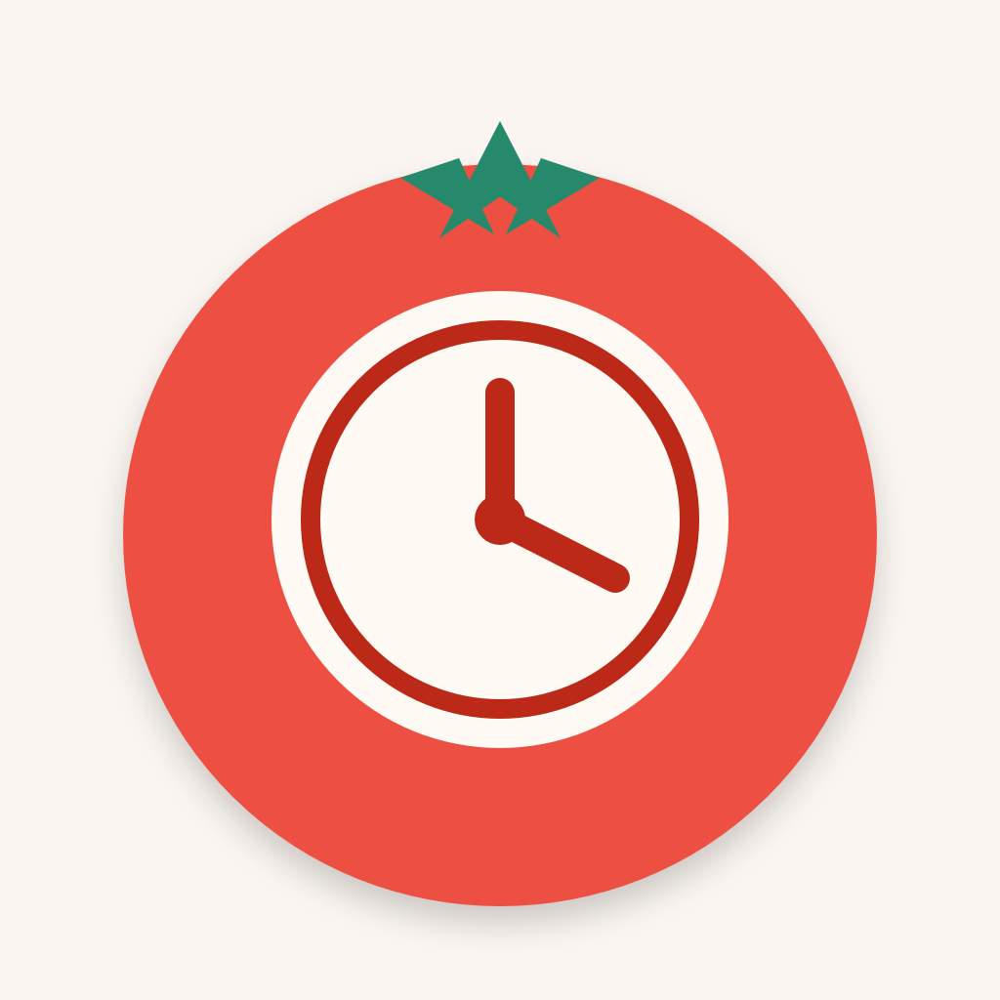
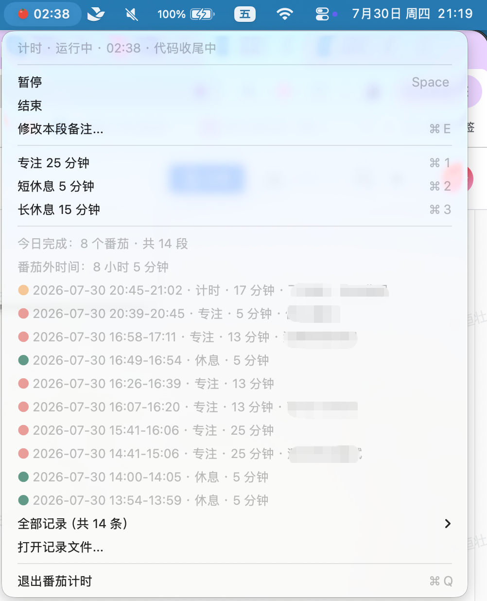

# Pomodoro Bar · 菜单栏番茄钟

一个轻量的 macOS 菜单栏番茄钟。

## 预览



## 功能

- 菜单栏显示番茄图标、倒计时和暂停状态
- 支持专注、短休息、长休息
- 点击模式菜单即可切换并开始
- 完成后发送 macOS 通知中心提醒
- 记录当天全部番茄和休息段
- 记录保存为可读 JSON：`~/.pomodoro-status-bar/records.json`
- 清空记录前自动备份

## 构建

```bash
./scripts/build.sh
```

构建产物会输出到：

```text
dist/PomodoroBar.app
```

## 记录格式

```json
[
  {
    "date" : "2026-07-28",
    "startedAt" : "2026-07-28 15:49:45",
    "endedAt" : "2026-07-28 16:14:45",
    "durationMinutes" : 25,
    "type" : "focus",
    "note" : "写周报"
  }
]
```

`type` 取值：

- `focus`
- `short_break`
- `long_break`
